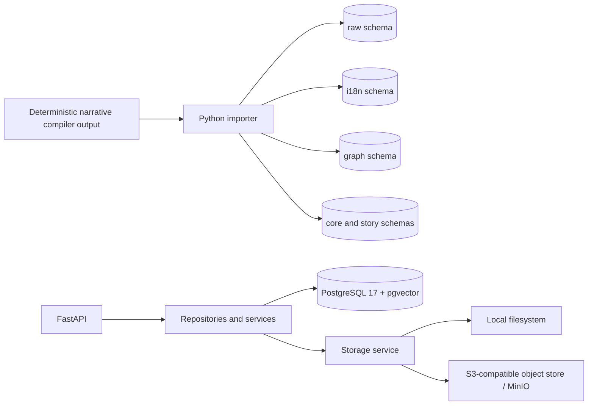
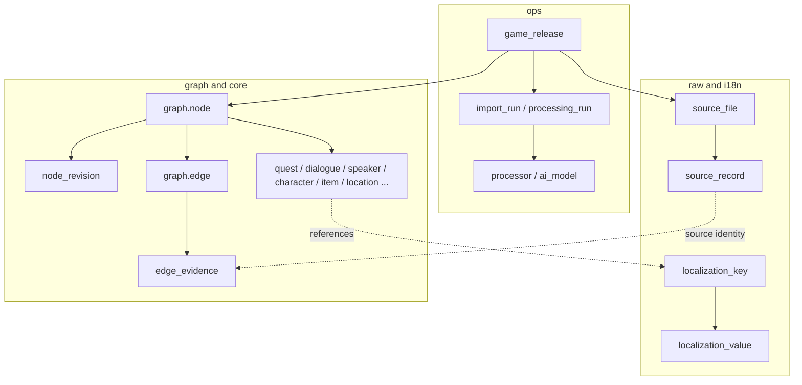
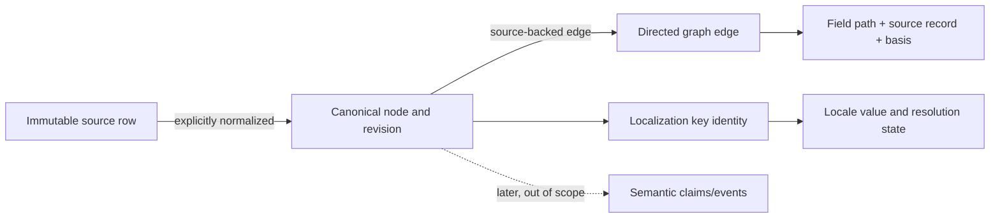

# Architecture

The service is split into API, persistence, ingestion, graph operations, search primitives, and storage adapters. PostgreSQL is the source of truth for metadata and canonical records. Large immutable objects use an interchangeable local or S3-compatible storage backend; a game-source path is provenance and is never treated as an object-store key.

The schema is divided into `ops`, `storage`, `raw`, `i18n`, `graph`, `core`, `ontology`, `story`, `content`, and `search`. `graph.edge.basis` distinguishes explicit references, exact joins, authored ordering, source-array adjacency, runtime conditions, and later semantic/manual relations. No authored order is asserted as actual player traversal.

Semantic claims and event extraction are represented as persistence contracts only; the importer does not populate them. Embedding tables are model-versioned and no vector index is required until an embedding model is selected.
